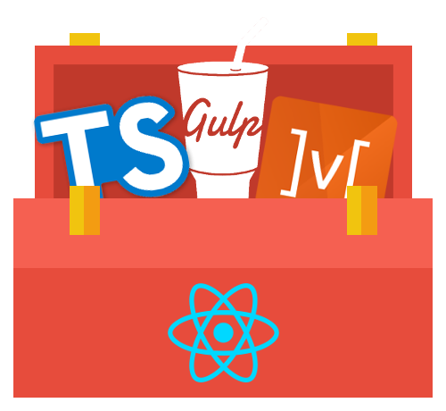

[![npm][npm]][npm-url]

<div align="center">
    
    <h1>react.js lunchbox</h1>
    <p>
        React.js lunchbox is a frontend full suite solution. It aims to provide you a streamline process from development to production!
    </p>
</div>
<h2 align="center">Introduction</h2>
<p>
React.js lunchbox is my approach to tackling a react.js application. The main goal of this project is to bring a structure to a very open platform for developing a react.js application. I use many modern day (to date) tools to help streamline develop processes.
</p>
<ul>
    <li> Strict typing </li>
    <li> Automation with templates to remove the need for rewriting react boilerplate </li>
    <li> Frontend unit testing </li>
    <li> Linting! </li>
    <li> Modular bundling </li>
</ul>

<div align="center">
    <h2>Getting Started</h2>
</div>

```
// Install node_modules
npm install

// Init Project space.
npm run generate:init

// Remove .git
rm -rf .git

// Run in development mode
npm run start:dev

```
    
<h2 align="center">Concepts</h2>

<p>
    I provide a full toolbox of technologies for you to use. This would hopefully help you develop faster and better code.
</p>

|Name|Description|
|:--:| :----------:|
|typescript| superset language for strict typing of our javascript|
|webpack| bundling and compiling of our typescript|
|mobx| state management|
|ui-router| router|
|ant design| css react framework|
|tslint| linting tool for typescript|
|karma| test runner for mocha (test framework)|
|mocha/chai/enzyme| test framework to do our testing of our components and services|
|plop| templated automation to get rid of the react boilerplates|

<h2 align="center">Project Structure</h2>
<p>
    React.js is a very opinated framework. It has many modules/libraries that can overwhelm the user and cause your codebase to become messy.
    I try to avoid that here by sticking to core react.js and mobx libraries.
</p>

```
.
└── config
|   └── default.json - development configuration
|
└── src
|   └── app - application code.
|   |   └── components - Commonly used modules throughout your application.
|   |   |   └── index.ts - A single entry point for exporting your components for easy importing.
|   |   └── containers - Entry points for each route. Containers are built by your different components.
|   |   |   └── index.ts - A single entry point for exporting your containers for easy importing.
|   |   └── services - Service layer of the application containing reusable services and stores (mobx).
|   |   |   └── index.ts - A single entry point for exporting your services for easy importing.
|   |   └── app.constants.ts - a single file for global application constants (i.e api url)
|   |   └── app.scss - Sass file for global application styling.
|   |   └── app.tsx - Main application tsx file (contains Authentication module)
|   |   └── router.config.ts - A single file to contain all routes.
|   └── index.html - base html file
|   └── index.tsx - the entry point for the application (wrapper to call). Here we set the provider, base entry element, stores, and routing history.
└── tools
|   └── webpack
|   |   └── webpack.dev.config.js - Development webpack bundling config.
|   |   └── webpack.dist.config.js - Production webpack bundling config.
└── .babelrc
└── karma.conf.js - karma runner config.
└── mocha.opts - mocha options.
└── tslint.json - linting config.
└── gulpfile.js - gulp task runner file
└── webpack.config.js - base webpack bundler.
└── tsconfig.json - typescript config.
└── package-lock.json - package management.
└── package.json
```

### Workflow:
I try to keep the methodology of reactjs, which is reusable components.

All of my reusable components would be contained in `src/app/components/<component>`. This allows me to keep my focus on that single component and cleaner importing.

Pages or views are kept inside `src/app/containers/<container>`. Containers are basically what react would consider a "Route's Component". It's what the route endpoint is looking to render. The idea here is that all containers are built by components.

### Workflow Bonuses:
I use gulp to kick start and speed up our development process by having "magic" keyboards or commands that would help us do things like generate components and containers (templated).

<h2 align="center"> Commands </h2>
<p>
    I use npm's scripts to make for faster development and workflow.
    Here is a list of commands you can run:
</p>

|Command|Action|
|:-----:|:----:|
|start:dev| Start development server|
|start:test| Start testing in watch mode|
|build:dist| Create dist for production. This will run linting in parallel to consistent formatting|
|generate| List all automated templates to create from|
|generate:init| Initiates the project (should only be ran once at the start of the project)|
|generate:component| Create a shared component|
|generate:container| Create a new page or containter|
|generate:service| Create a new service/state store|


# Resources:
- [Mobx](https://mobx.js.org/intro/overview.html)
- [UIRouter](https://ui-router.github.io/react/)
- [Webpack](https://webpack.github.io/docs/)
- [Ant Design](https://ant.design/docs/react/introduce)

[npm]: https://img.shields.io/npm/v/npm.svg
[npm-url]: https://nodejs.org/en/download/