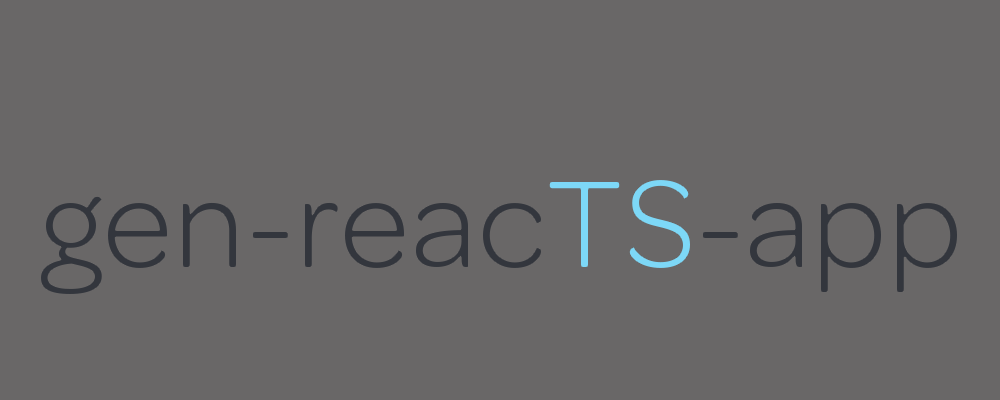

# ARCHIEVED:

Just use create-react-app (as it supports typescript): Keep an eye out for a repurpose of this library's plop templates. I am looking to create a template generator tool for react components that will speed up your development.

<center>

</center>

# gen-reacts-app

Inspired by create-react-app, this small tool generates a production ready react with typescript web application.
This base application contains tools like react-router, styled-components, typescript, webpack 4, plopjs for consistent templating, and jest snapshot testing.

## Installation:

```bash
    # With NPM
    npm install -g gen-reacts-app

    # With Yarn
    yarn global add gen-reacts-app
```

This tool requires Node > v6 .

## How to use:

```bash
    gen-reacts-app <title>
```

## Commands

|    Command    |            Description            |
| :-----------: | :-------------------------------: |
|     build     |   production application build    |
|      dev      |     run local dev application     |
|      gen      |             run plop              |
|  gen:common   |     generate common component     |
| gen:component |        generate component         |
|   gen:page    |           generate page           |
|    gen:hoc    |           generate hoc            |
|     test      |          run jest tests           |
|   test:cov    | run jest tests with test coverage |

## Philosophy

The goal of this tool is the generate a react project with structure, type safety, and consistent code styling.

## Resources

*   [styled-components](https://www.styled-components.com/)
*   [react-router](https://reacttraining.com/react-router/web/guides/philosophy)
*   [webpack 4](https://webpack.js.org/concepts/)

You can view the base react application [here](https://github.com/roger-king/gen-reacts-app/tree/master/base)
